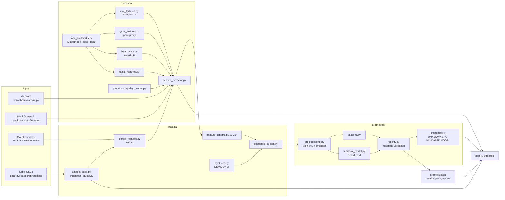
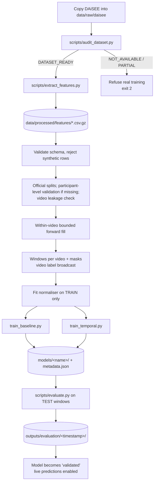
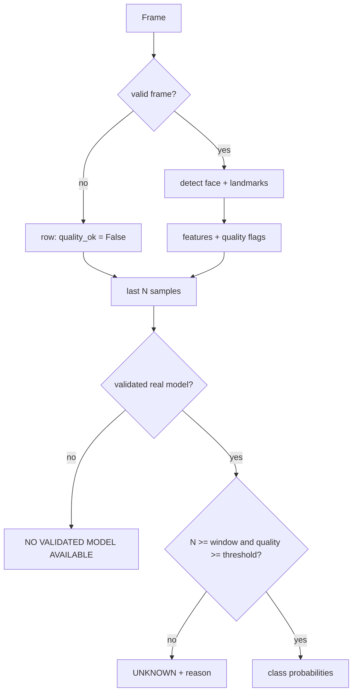

# Architecture and data flow

## Component architecture

```mermaid
flowchart LR
  subgraph Input
    CAM[Webcam<br/>src/webcam/camera.py]
    MOCK[MockCamera / MockLandmarkDetector]
    VID[DAiSEE videos<br/>data/raw/daisee/videos]
    ANN[Label CSVs<br/>data/raw/daisee/annotations]
  end
  subgraph Vision["src/vision"]
    LM[face_landmarks.py<br/>MediaPipe / Tasks / Haar]
    EYE[eye_features.py<br/>EAR, blinks]
    GAZE[gaze_features.py<br/>gaze proxy]
    HP[head_pose.py<br/>solvePnP]
    FAC[facial_features.py]
    QC[processing/quality_control.py]
    FE[feature_extractor.py]
  end
  subgraph Data["src/data"]
    AUD[dataset_audit.py<br/>annotation_parser.py]
    EXT[extract_features.py<br/>cache]
    SCH[feature_schema.py v1.0.0]
    SEQ[sequence_builder.py]
    SYN[synthetic.py<br/>DEMO ONLY]
  end
  subgraph Models["src/models"]
    PRE[preprocessing.py<br/>train-only normaliser]
    BASE[baseline.py]
    TMP[temporal_model.py<br/>GRU/LSTM]
    REG[registry.py<br/>metadata validation]
    INF[inference.py<br/>UNKNOWN / NO VALIDATED MODEL]
  end
  EVAL[src/evaluation<br/>metrics, plots, reports]
  UI[app.py Streamlit]

  CAM --> FE
  MOCK --> FE
  VID --> EXT
  ANN --> AUD --> EXT
  LM --> EYE & GAZE & HP & FAC --> FE
  QC --> FE
  FE --> SCH
  EXT --> FE
  SCH --> SEQ --> PRE --> BASE & TMP --> REG
  SYN --> SEQ
  REG --> INF --> UI
  REG --> EVAL --> UI
  FE --> UI
  AUD --> UI
```

## Research-mode data flow

```mermaid
flowchart TD
  A[Copy DAiSEE into data/raw/daisee] --> B[scripts/audit_dataset.py]
  B -->|DATASET_READY| C[scripts/extract_features.py]
  B -->|NOT_AVAILABLE / PARTIAL| X[Refuse real training<br/>exit 2]
  C --> D[(data/processed/features/*.csv.gz)]
  D --> E[Validate schema, reject synthetic rows]
  E --> F[Official splits; participant-level validation if missing;<br/>video leakage check]
  F --> G[Within-video bounded forward fill]
  G --> H[Windows per video + masks<br/>video label broadcast]
  H --> I[Fit normaliser on TRAIN only]
  I --> J[train_baseline.py]
  I --> K[train_temporal.py]
  J & K --> L[(models/&lt;name&gt;/ + metadata.json)]
  L --> M[scripts/evaluate.py on TEST windows]
  M --> N[(outputs/evaluation/&lt;timestamp&gt;/)]
  N --> O[Model becomes 'validated'<br/>live predictions enabled]
```

## Live inference gating

```mermaid
flowchart TD
  F[Frame] --> Q{valid frame?}
  Q -- no --> R[row: quality_ok = False]
  Q -- yes --> D[detect face + landmarks] --> R2[features + quality flags]
  R & R2 --> W[last N samples]
  W --> V{validated real model?}
  V -- no --> NM[NO VALIDATED MODEL AVAILABLE]
  V -- yes --> S{N >= window and quality >= threshold?}
  S -- no --> U[UNKNOWN + reason]
  S -- yes --> P[class probabilities]
```
